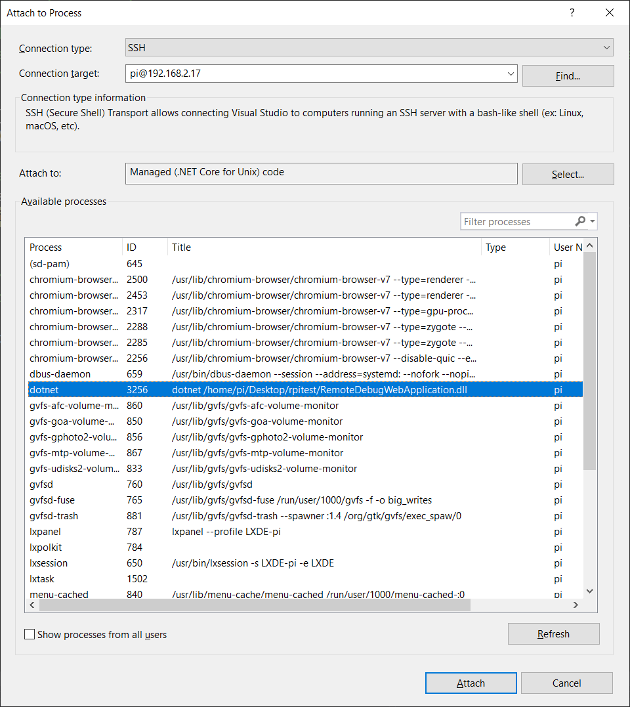

# RemoteDebugWebApplication

This project is an attempt to automate the build and debug process of an aspnetcore application for a Raspberry Pi.

## Prerequisites

### AspNetCore 3.1 runtime on the Raspberry Pi
The project assumes you have .netcore3.1 runtimes installed on the Raspberry Pi.
How-to: https://edi.wang/post/2019/9/29/setup-net-core-30-runtime-and-sdk-on-raspberry-pi-4

### Passwordless SSH
It is assumed that you have previously setup SSH and the Raspberry Pi for passwordless connection.
See https://www.raspberrypi.org/documentation/remote-access/ssh/passwordless.md 
or https://blogs.endjin.com/2019/09/passwordless-ssh-from-windows-10-to-raspberry-pi/

## Profiles
The project has 2 profiles: "IISExpress" and "RemoteDebugWebApplication".
- "IISExpress" will build and debug the project for the local computer as normally.
- "RemoteDebugWebApplication" will build and publish the project locally for linux-arm archtecture, and then copy and start the project on a Raspberry Pi. 

## "RemoteDebugWebApplication" profile 
When starting this profile, the project will be built and published to the local folder 'RemoteDebugWebApplication\bin\Debug\netcoreapp3.1\linux-arm\publish'
NB: The publish step is configured for 'Framework dependent' rather than 'Self-contained', otherwise the entire framework should be copied to the Raspberry Pi.

These files are then copied to the Raspberry Pi.
Then the project is started on the Raspberry Pi.

The magic that makes this all happen are the files:
- publish.bat
- Properties\launchSettings.json
- Properties\PublishProfiles\RemoteDebug.pubxml

## How to debug
You must  start the debugging process by attaching to the project's process on the Raspeberry Pi.
Choose 'Debug' -> 'Attach to process'
Connection type: 'SSH'
Connection target: username@ip address of the Raspberry Pi, e.g. pi@192.168.2.17

When you stop debugging in VS2019, the process remains running on the Raspberry Pi.
You may kill it on the Raspberry Pi, but also the "RemoteDebugWebApplication" profile will try to kill it before uploading a new version.

